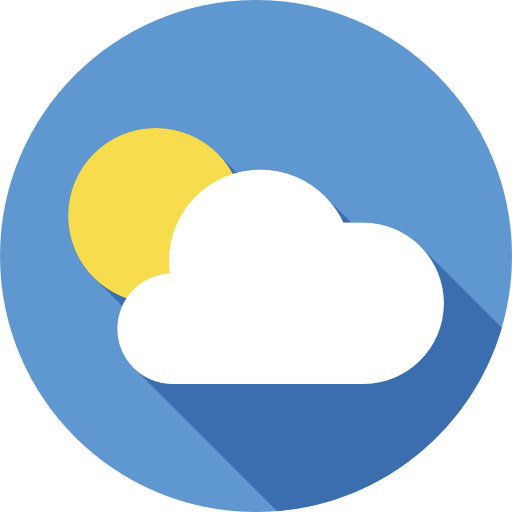

<h1 align="center">Application React de Météo</h1>

<p align="center">
    <a target="_blank"></a>
    <a target="_blank"></a>
</p>

Suivi du tuto de la [PlayList YouTube](https://youtu.be/jte3AQRPj_8).


Table des matières.
> * [Utilisation](#Utilisation)
> * [Initialisation](#Initialisation)
> * [Développement](#Développement)
> * [Apk](#Apk)
> * [Idée](#Idée)


&nbsp;
## Utilisation
---

```bash
npm install
expo start
```


&nbsp;
## Initialisation
---

Cree l'app
```bash
expo init meteo-app # blank
```


&nbsp;
## Initialisation
---

Install de la lib [Axios](https://github.com/qiangmao/axios) pour faire les requête API. Ainsi que [Date-fns](https://github.com/date-fns/date-fns) pour manipuler les dates. Et enfin [expo-location](https://docs.expo.dev/versions/latest/sdk/location/) pour récupérer la loc du telephone.  
```bash
npm i react-native-axios
npm install date-fns
expo install expo-location
```

On demande l'autorisation d’accès à la localisation, puis on la met dans un state.  

On install [react-native-dotenv](https://bestofreactjs.com/repo/zetachang-react-native-dotenv-react-native-system) pour mettre nos clef dans un fichier `.env`.
```bash
npm install react-native-dotenv
npm install metro-react-native-babel-preset
```

Puis on change le fichier `babel.config.js` [solution](https://stackoverflow.com/questions/64225453/unknown-option-error-from-babel-in-react-native-app).  

Pour récupérer les images on crée un fichier `Icon.js` qui contient un Json avec les bon require.  


&nbsp;
## Apk
---

On fait un eject de l'application
```bash
npm run eject
cd .\android\
.\gradlew clean
```

Et apres on génère une clef, suivre le tuto [https://reactnative.dev/docs/signed-apk-android](https://reactnative.dev/docs/signed-apk-android).
```bash
keytool -genkeypair -v -storetype PKCS12 -keystore meteo-app-key.keystore -alias meteo-app -keyalg RSA -keysize 2048 -validity 10000
./gradlew assembleRelease
```


&nbsp;
## Idée
---

- Une page de réglage :
  - Changer de loc (Google Api : Place Autocomplete)
  - Mettre en place des notifications à une heure précise le matin avec la prévision de la journée